# Full Job Loop — Local Operational Test

Prove a deposit booking moves from **deposit paid** → **fully paid** with cleaner payout eligibility (`JobPayout` status `READY`).

**Safety:** Use Stripe **test mode only** (`sk_test_` / `pk_test_`). Do **not** enable `BOOKING_PAYMENT_MODE=deposit` in production yet.

---

## Prerequisites

### 1. Environment (`.env.local`)

| Variable | Example / notes |
|----------|-----------------|
| `BOOKING_PAYMENT_MODE` | `deposit` |
| `BOOKING_DEPOSIT_CENTS` | `2500` |
| `NEXT_PUBLIC_BASE_URL` | `http://localhost:3000` |
| `STRIPE_SECRET_KEY` | `sk_test_...` (VelocityMaid test account) |
| `NEXT_PUBLIC_STRIPE_PUBLISHABLE_KEY` | `pk_test_...` |
| `STRIPE_WEBHOOK_SECRET` | From `stripe listen` (see below) |
| `ADMIN_EMAIL` | `admin@velocitymaid.com` |
| `E2E_CLEANER_EMAIL` | Optional — default `cleaner.nj@velocitymaid.com` |

### 2. Database

```bash
npx dotenv-cli -e .env.local -- npx prisma migrate deploy
npx prisma generate
```

Migration `20260607150000_add_job_payout_and_on_the_way` adds `JobPayout` and `ON_THE_WAY` job status.

### 3. Dev server + Stripe webhooks

Terminal A:

```bash
npm run dev
```

Terminal B:

```bash
stripe listen --forward-to localhost:3000/api/webhooks/stripe
```

Copy the `whsec_...` value into `STRIPE_WEBHOOK_SECRET` and restart `npm run dev` if you change it.

### 4. Admin + test cleaner

```bash
npx dotenv-cli -e .env.local -- npx tsx scripts/setup-admin.ts
npx dotenv-cli -e .env.local -- npx tsx scripts/seed-cleaner.ts
```

The seed script creates/updates:

- Active cleaner on **New Jersey** branch
- **APPROVED** `CleanerApplication` (required for manual assignment)
- Email: `E2E_CLEANER_EMAIL` or `cleaner.nj@velocitymaid.com`

---

## Quick test (one booking end-to-end)

After assign, run this to move Caryll's job to **today** (no need to wait for June 2026):

```bash
npx dotenv-cli -e .env.local -- npx tsx scripts/advance-test-job.ts --customer=Caryll
```

Skip cleaner steps and jump to balance payment:

```bash
npx dotenv-cli -e .env.local -- npx tsx scripts/advance-test-job.ts --customer=Caryll --complete
```

**Admin:** `/admin/jobs` → purple **Open cleaner job →** button in **Next Step** column  
**Cleaner:** `/cleaners/login` → `/cleaner/jobs/[jobId]` → Accept → Start → Complete  
**Customer:** `/customer/jobs` (not `/customer/dashboard`) → tap booking → Pay Remaining Balance

---

## Step-by-step flow

### 1. Deposit booking (customer)

1. Open `http://localhost:3000/book` (New Jersey).
2. Complete the wizard and pay the **$25 deposit** with test card `4242 4242 4242 4242`.
3. Confirm redirect to `/book/confirmation`.

**Expected job state:**

| Field | Value |
|-------|--------|
| `paymentStatus` | `DEPOSIT_PAID` |
| `reviewStatus` | `PENDING` |
| `status` | `RECEIVED` |
| Cleaner | Unassigned |

**Verify:** Admin → Jobs → open the new job.

---

### 2. Admin review — approve

1. Log in at `/admin/login` with `ADMIN_EMAIL` (email only).
2. Open the job detail page.
3. In **Booking Review**, click **Approve Booking**.

**Expected:**

| Field | Value |
|-------|--------|
| `reviewStatus` | `APPROVED` |
| `paymentStatus` | `DEPOSIT_PAID` (unchanged) |
| `status` | `CONFIRMED` (if was `RECEIVED`) |
| Assignment UI | Enabled |

**Reject path (optional):** Click **Reject** → deposit refund via Stripe test mode → `REJECTED` / `REFUNDED` / `CANCELLED`.

---

### 3. Assign cleaner (admin)

1. On the same job detail page, **Assign Cleaner** section.
2. Select the seeded NJ cleaner (e.g. John Cleaner (Test)).
3. Click assign.

**Expected:**

| Field | Value |
|-------|--------|
| `assignedCleanerId` | Seeded cleaner id |
| `status` | `ASSIGNED` |

If assignment fails with `NOT_APPROVED`, re-run `scripts/seed-cleaner.ts`.

---

### 4. Cleaner completion flow

**Login URL:** `/cleaners/login` (note: login lives under `/cleaners/*`; the job portal is `/cleaner/*`)  
**Method:** Email-only, passwordless — enter the seeded cleaner email; no magic link or OTP. The API sets an HTTP-only `cleanerId` cookie (real `User.id` for email logins).  
**Email:** `cleaner.nj@velocitymaid.com` (must match the assigned cleaner)

**Automated test:**

```bash
npx dotenv-cli -e .env.local -- npx tsx scripts/test-cleaner-login.ts
npx dotenv-cli -e .env.local -- npx tsx scripts/test-cleaner-job-flow.ts
```

**Note:** Shell `curl` on Windows can mangle JSON and return `{ "error": "Login failed" }`. Use the scripts above or the browser form.

After login you are redirected to **My Jobs** at `/cleaner/jobs`.

| Page | URL |
|------|-----|
| Cleaner login | `/cleaners/login` |
| My jobs list | `/cleaner/jobs` |
| Job detail + actions | `/cleaner/jobs/[jobId]` |

**API routes (same `cleanerId` cookie):**

| Method | Route |
|--------|-------|
| GET | `/api/cleaner/jobs` |
| GET | `/api/cleaner/jobs/[jobId]` |
| PATCH | `/api/cleaner/jobs/[jobId]/accept` |
| PATCH | `/api/cleaner/jobs/[jobId]/start` |
| PATCH | `/api/cleaner/jobs/[jobId]/complete` |

From admin job detail, use **Open Cleaner Job →** or **Cleaner Login**.

1. **Accept & On The Way** → status `ON_THE_WAY`
2. **Start Service** → status `IN_PROGRESS`
3. **Complete Job** → status `COMPLETED`, payment `BALANCE_DUE`

**Dev shortcut (optional):** On admin job detail in development only, **Dev only — skip cleaner workflow** sets `COMPLETED` + `BALANCE_DUE` without using the cleaner portal.

**Expected after completion:**

| Field | Value |
|-------|--------|
| `status` | `COMPLETED` |
| `paymentStatus` | `BALANCE_DUE` |
| `balanceDue` | `quotedTotal - amountPaid` (> 0) |
| `JobPayout` | **Not created yet** |

---

### 5. Customer balance payment

1. Customer opens job detail: `http://localhost:3000/customer/jobs/[jobId]`  
   (From admin job detail, click **Open Customer Job →** after completion.)
2. Confirm **“Your service is complete”** and **Pay Remaining Balance** are visible.
3. Click pay → Stripe Checkout for the balance amount.
4. Pay with test card `4242...`.
5. Wait for webhook (`[200]` in `stripe listen`).

**Expected after webhook:**

| Field | Value |
|-------|--------|
| `paymentStatus` | `PAID` |
| `amountPaid` | `quotedTotal` |
| `balanceDue` | `0` |
| `JobPayout.status` | `READY` |

---

### 6. Payout verification (admin)

Refresh admin job detail → **Cleaner Payout** section:

- Status: `READY`
- Cleaner amount: 65% of gross (rules `v1-65-35`)
- Eligibility: **Ready**

Duplicate webhook deliveries must **not** create a second `JobPayout` (unique `jobId` + idempotent `createPayoutIfEligible`).

---

### 7. Mark cleaner paid (admin — manual payout)

After paying the cleaner outside the app (Zelle, Cash App, bank transfer, cash, or check):

1. Open admin job detail → **Cleaner Payout** (status `READY`).
2. Optionally select payment method, add a note, and reference/transaction ID.
3. Click **Mark Cleaner Paid**.

**API:** `POST /api/admin/jobs/[jobId]/payout/mark-paid`

**Expected:**

| Field | Value |
|-------|--------|
| `JobPayout.status` | `PAID` |
| `JobPayout.paidAt` | Set |
| `JobPayout.executionMethod` | e.g. `ZELLE`, `CASH`, `BANK` |
| Second mark-paid attempt | **409** — already PAID |

Stripe Connect automatic payout is **not** required for this step; this is manual payout tracking only.

---

## Refund test path (admin reject)

Use a **separate** deposit booking (do not reject a job you still need for the happy path).

| Step | Action | Expected |
|------|--------|----------|
| 1 | Customer pays $25 deposit | `DEPOSIT_PAID`, review `PENDING` |
| 2 | Admin → **Reject** | Stripe refund in test dashboard |
| 3 | Job | `REJECTED`, `REFUNDED`, `CANCELLED` |
| 4 | Reject again | Idempotent — no double refund |

---

## Automated helper (optional)

For scripted checks after a manual deposit payment:

```bash
npx dotenv-cli -e .env.local -- npx tsx scripts/deposit-e2e-verify.ts
```

Note: Stripe hosted Checkout still requires browser payment for step 1 unless you poll/wait.

---

## Validation commands

Stop `npm run dev` before `prisma generate` if Windows reports EPERM on the query engine.

```bash
npx prisma validate
npx dotenv-cli -e .env.local -- npx prisma generate
npm run build
```

---

## Troubleshooting

| Symptom | Fix |
|---------|-----|
| Booking confirmation fails / duplicate job | Webhook + create race — ensure latest `upsertJobFromCheckoutSession` is deployed; retry booking |
| Assignment blocked | Approve booking first; run `seed-cleaner.ts` for APPROVED application |
| Cleaner cannot see job | Log in with assigned cleaner **email** at `/cleaners/login`; re-login if you had an old hash-based cookie. List: `/cleaner/jobs`, detail: `/cleaner/jobs/[jobId]` |
| "Failed to fetch job" / 401 | Not logged in — use `/cleaners/login` with `cleaner.nj@velocitymaid.com` |
| "Not assigned to you" / 403 | Cookie cleaner id ≠ `assignedCleanerId` — log out and re-login with the assigned cleaner email |
| Complete blocked | Job must be `IN_PROGRESS` (Accept → Start first) at `/cleaner/jobs/[jobId]` |
| Reused fully paid job for cleaner test | **Do not** rerun cleaner completion on a job that is already `PAID` or has `JobPayout.status = PAID`. Book a **fresh deposit job** per full-loop test. Automated script `test-cleaner-job-flow.ts` only picks `DEPOSIT_PAID` jobs without a PAID payout. |
| `paymentStatus=BALANCE_DUE` but payout `PAID` | Data drift from re-testing on a closed job. Dry-run: `npx dotenv-cli -e .env.local -- npx tsx scripts/repair-paid-payout-payment-status.ts` · Apply locally: add `-- --apply --force-local` |
| No next step after assign | Admin job detail → **Operational Progress** → **Open Cleaner Job →** |
| Balance pay blocked | Job must be `COMPLETED` + `BALANCE_DUE` + `balanceDue > 0` |
| Payout missing after balance pay | Check `stripe listen` logs; verify `STRIPE_WEBHOOK_SECRET`; confirm `JobPayout` migration applied |
| Admin cleaners list 500 / `Invalid value for argument notIn. Expected JobStatus` | Ensure routes use Prisma enum values (`CANCELLED`, `COMPLETED`) not lowercase strings |
| Prisma generate EPERM | Stop dev server, retry generate |

---

## Status reference

```mermaid
flowchart LR
  A[Deposit paid] --> B[Admin approve]
  B --> C[Assign cleaner]
  C --> D[Accept ON_THE_WAY]
  D --> E[Start IN_PROGRESS]
  E --> F[Complete BALANCE_DUE]
  F --> G[Customer pays balance]
  G --> H[PAID + Payout READY]
  H --> I[Admin mark cleaner paid]
  I --> J[Payout PAID]
```



---

## Verified local test result (2026-06-12)

End-to-end run completed successfully in **local** development with **Stripe test mode**.

| Field | Result |
|-------|--------|
| **Date** | 2026-06-12 |
| **Environment** | Local (`localhost:3000`) |
| **Stripe mode** | Test (`sk_test_` / `pk_test_`, `stripe listen`) |
| **Customer / job** | Caryll M — `d4bd1994-f4ec-4a51-8890-06830083c90a` (**closed** — COMPLETED/PAID/payout PAID; do not reuse for cleaner-completion tests) |
| **Cleaner** | John Cleaner (Test) — `cleaner.nj@velocitymaid.com` |
| **Final job status** | `COMPLETED` |
| **Payment status** | `PAID` |
| **Payout status** | `PAID` (after admin **Mark Cleaner Paid**) |
| **Payout amount** | ~$124 to cleaner (65% of $190 gross) |
| **Duplicate mark-paid** | **409** — expected, payout already PAID |

Flow exercised: deposit → admin approve → assign → cleaner accept/start/complete → customer balance pay → payout `READY` → admin mark paid.

---

## Production readiness

**Do not enable deposit mode in production until the production Stripe webhook is confirmed end-to-end.**

| Environment | Stripe keys | `BOOKING_PAYMENT_MODE=deposit` |
|-------------|-------------|--------------------------------|
| **Local / staging** | Test keys only (`sk_test_`, `pk_test_`) | OK for QA when `stripe listen` or staging webhook is configured |
| **Production (Vercel)** | Live keys (`sk_live_`, `pk_live_`) | Set `BOOKING_PAYMENT_MODE=deposit` on Vercel → redeploy. Checkout charges **$25**; UI reads `/api/booking/payment-config` at runtime. |

Checklist before production cutover:

1. Register production webhook URL → `/api/webhooks/stripe` in Stripe Dashboard (live mode).
2. Set `STRIPE_WEBHOOK_SECRET` to the **live** signing secret (not the CLI `whsec_` from local listen).
3. Confirm deposit and balance checkout sessions complete and update jobs via webhook (not just redirect).
4. Run one live-mode smoke test with a real card in a controlled environment before opening to customers.
5. Keep manual **Mark Cleaner Paid** until Stripe Connect automated payout is explicitly enabled.

Never commit `.env.local`, live Stripe keys, or webhook secrets to git.
